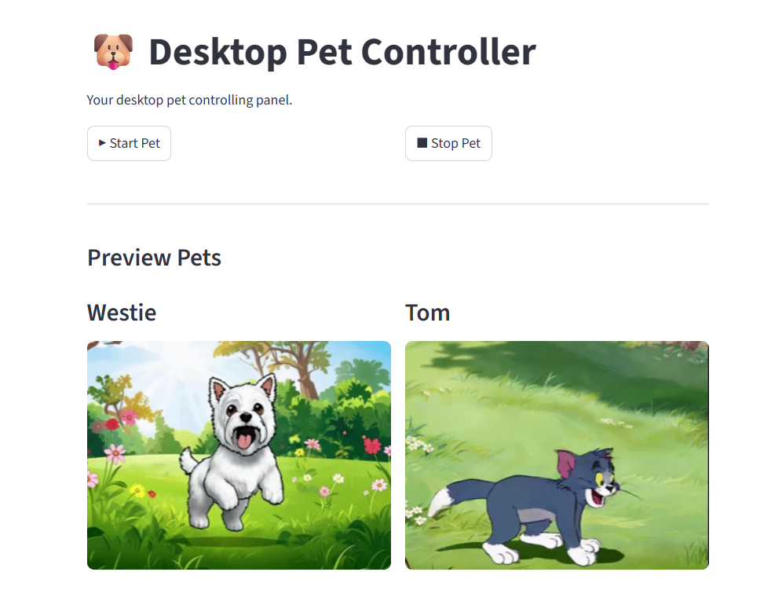
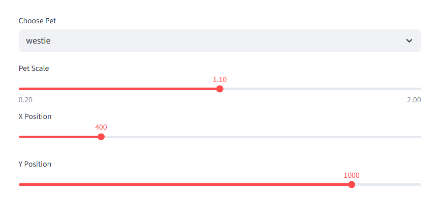
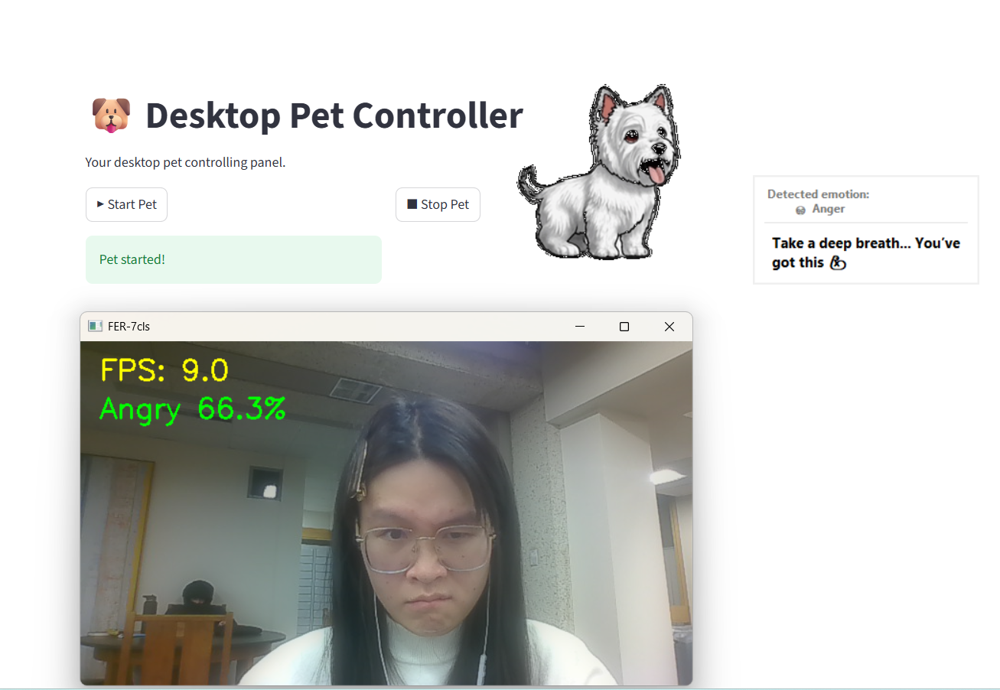
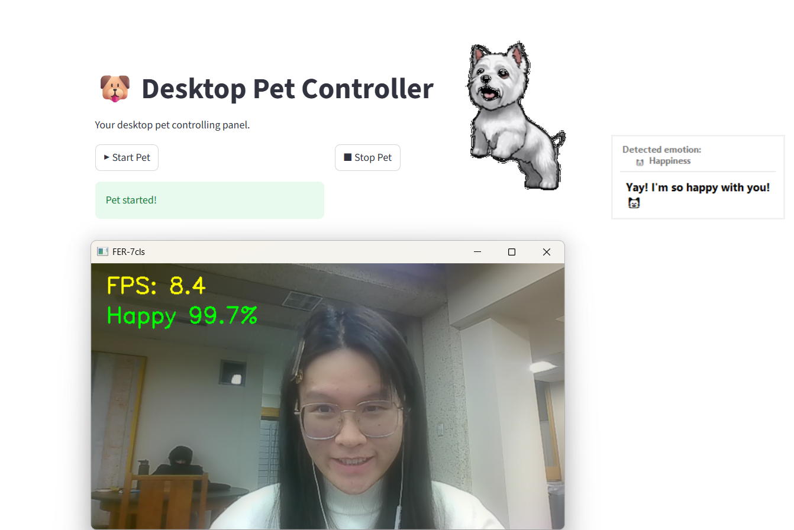
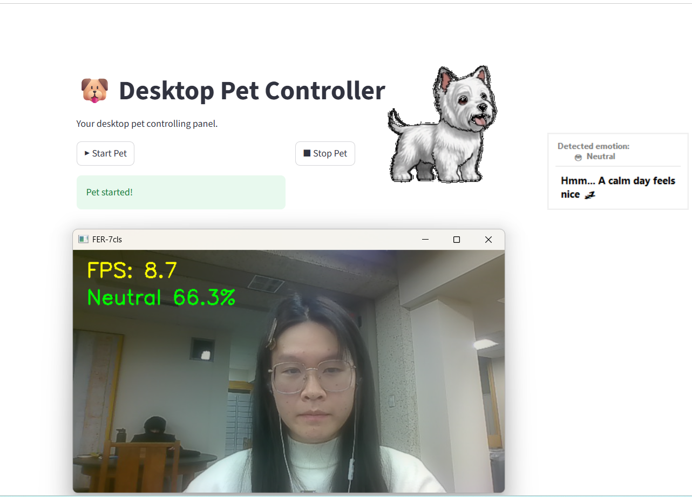
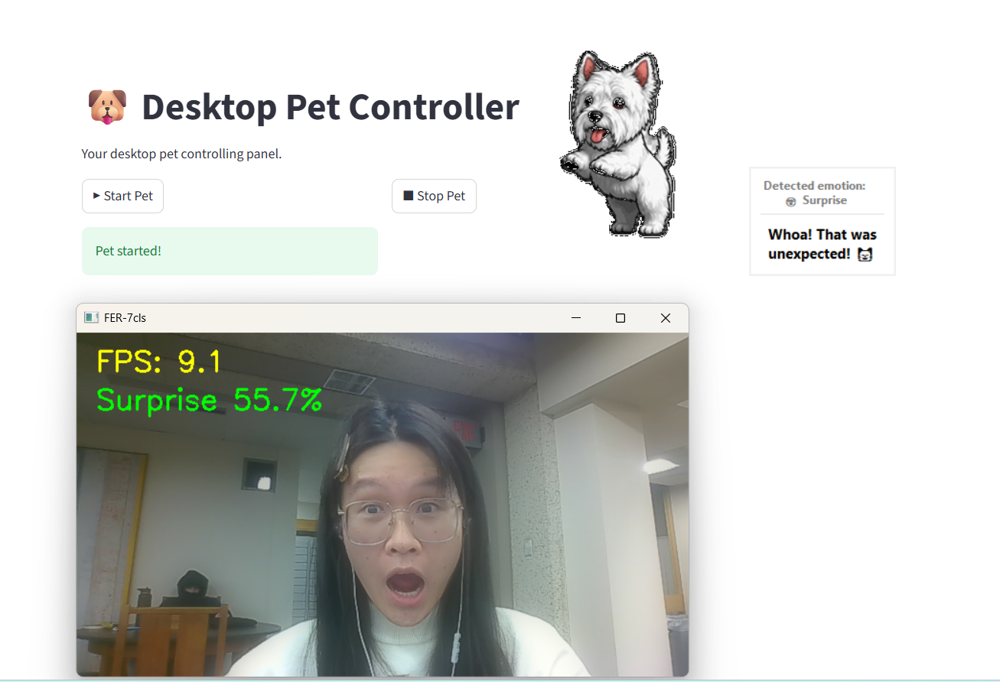
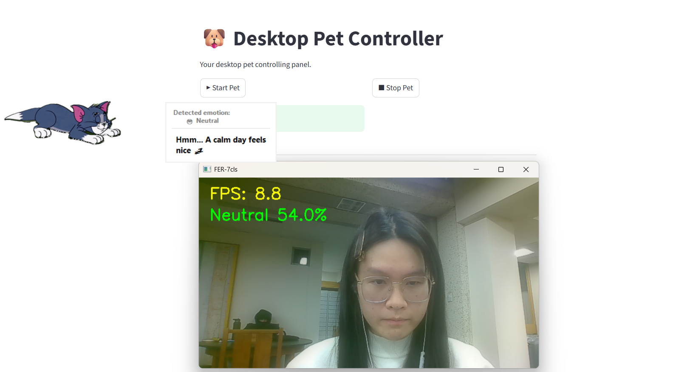
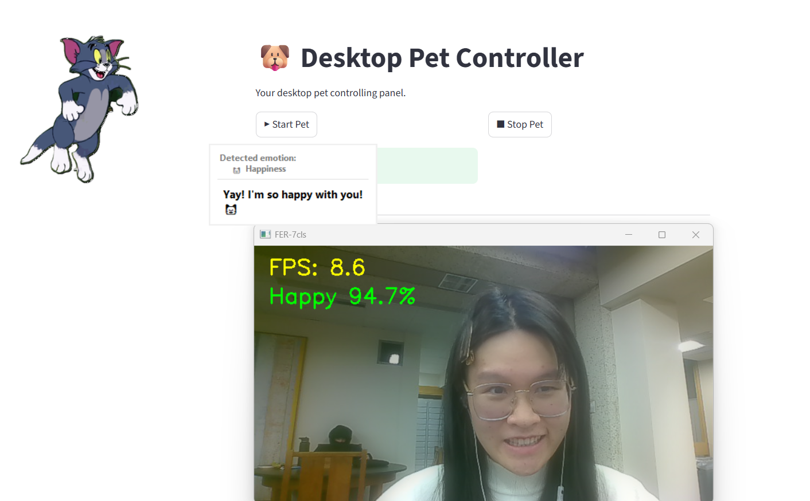

# ❤️ Your Emotion-Sensing Desktop Pet  
*A real-time emotion-aware virtual companion powered by deep learning.*

---

## 🐾 Overview

Your Emotion-Sensing Desktop Pet is an intelligent virtual companion that reacts to your facial expressions in real time.  
It combines **deep-learning emotion recognition**, **Tkinter animated pets**, and **speech bubble feedback** to create a personalized desktop experience.

The system supports **two control interfaces**:

1. **Streamlit Web Control Panel** (browser UI)  
2. **Tkinter + ttkbootstrap Desktop Controller UI** (standalone UI application)

You may also choose to **display or hide the camera window**, and **customize the camera preview size**.

---

## 🖼️ UI Snapshot Gallery
---
### 🖥 Streamlit Web Control Panel  
This is the browser-based interface for adjusting pet type, scale, and live emotion monitoring.



---

### 🪟 Tkinter / ttkbootstrap Desktop Controller  
This standalone application allows controlling the pet without using a browser.


### 🔘 Choosing Panel  
This is the first interface where the user selects a pet character.

These screenshots demonstrate how the animated GIF updates based on real-time emotion detection.


---
### 🐶 Westie – Emotion Display Examples  
Westie pet supports all emotion animations. Examples below:

| Angry | Happy | Neutral |
|--------|--------|----------|
|  |  |  |

| Sad | Surprise |
|------|-----------|
|  |  |

---

### 🐱 Tom – Emotion Display Examples  
Below are the UI snapshots of the Tom desktop pet under different detected emotions.

| Tom Neutral | Tom Happy |
|-------------|-----------|
|  |  |

---

## ✨ Features

### 🎥 Real-Time Emotion Recognition
- Uses webcam input to detect emotions continuously.
- Based on **EfficientNet-B0 + dual-head mouth model**.
- Supports 7-class FER:  
  `Happy, Sad, Angry, Neutral, Surprise, Disgust, Fear`
- Includes EMA smoothing + mouth-enhanced fusion.
- Camera window **can be enabled or disabled**.

---

### 🐶 Animated Desktop Pet
- Floating Tkinter window with transparent background.
- Always-on-top and draggable.
- Multiple pet characters (`westie`, `tom`).
- Each pet includes 5 emotion animations:
  - happy  
  - sad  
  - angry  
  - surprise  
  - neutral  

---

### 💬 Emotion-Based Speech Bubbles
- Speech bubbles appear beside the pet.
- Automatically reflects the detected emotional state.
- Shows emoji + supportive phrases.

---

### 🖥 Controller Options

---

#### **1. Streamlit Control Panel**
- Start / Stop pet instance  
- Adjust pet type  
- Change scale and window position  
- Optional camera preview  
- Visualized real-time emotion updates  

Screenshot:  


---

#### **2. Tkinter / ttkbootstrap Desktop UI**
- Modern appearance  
- Works offline  
- Includes pet preview thumbnails  
- Uses multiprocessing to sync states  

Screenshot:  


---


## 🔧 System Architecture

```
Streamlit / Tkinter Controller 
            │
            ▼
 Multiprocessing Manager (shared state)
            │
            ├── Desktop Pet Process (Tkinter GIF engine)
            │         - Reads pet_type / scale / position
            │         - Displays animations
            │         - Shows speech bubble
            │
            └── Emotion Detection Thread (Camera)
                      - Runs model inference
                      - Sends emotion label back via callback
```

---

## 📦 Installation

### 1. Clone the repository
```bash
git clone https://github.com/Hiuching-Jyu/Your-Emotion-Sensing-Desktop-Pet.git
cd Your-Emotion-Sensing-Desktop-Pet
```

### 2. Install dependencies
```bash
pip install -r requirements.txt
```

---

## ▶️ Usage Options

---

# Option A — **Run with Streamlit Control Panel**

Start the web-based controller:

```bash
streamlit run app.py
```

This gives you:

- Start / Stop pet  
- Choose pet type  
- Adjust scale & position  
- Enable/disable camera preview  
- Real-time emotion feed in UI  

[insert image — Streamlit dashboard]

---

# Option B — **Run with Tkinter / ttkbootstrap Desktop UI**

```bash
python tkinter_controller.py
```

This UI provides:

- A modern look (ttkbootstrap theme)
- Gif previews
- Independent process launching
- Pet settings sliders

[insert image — Tkinter controller]


---

## 🎥 Camera Window Customization

You can control size & visibility inside **real_time.py → start_emotion_stream()**.

### **Hide camera window entirely**
```python
start_emotion_stream(callback=..., show_window=False)
```

### **Show camera window with custom size**
Add this before `imshow`:

```python
cv2.namedWindow("FER-7cls", cv2.WINDOW_NORMAL)
cv2.resizeWindow("FER-7cls", 480, 300)   # Custom size
```

---

## 🧠 Emotion Model

Model: `FER7WithMouth (EfficientNet-B0 backbone)`  
Features:
- Dual-head (full face + mouth)
- EMA smoothing
- Mouth-weighted fusion
- Fear merged into Surprise (your rule)

[insert image — model architecture]

---

## 🐾 Desktop Pet Engine (Tkinter)

Features:
- Transparent background  
- Always-on-top  
- Drag to move  
- Automatic scaling  
- Independent animation thread  
- Emotion bubble every few seconds  

To modify pet GIFs, replace files in:

```
westie_gif/
tom_gif/
```

---

## 🤝 Authors

**Xiaoqing Zhu**, **Yizhou Zhang**, **Hsin Wang**  
University of Pennsylvania  
Date: **December 2025**

---

## 📜 License

MIT License — see `LICENSE` file.

---

## ⭐ Acknowledgements

- EfficientNet-B0 — PyTorch  
- MediaPipe face detection  
- Tkinter + ttkbootstrap UI framework  

---

# 💡 Future Work

- Add fine-grained emotion categories  
- Multi-pet ecosystem  
- LLM-powered chat bubble (Doubao integration)  
- Voice emotion recognition  
- Custom user-defined animations  

---

